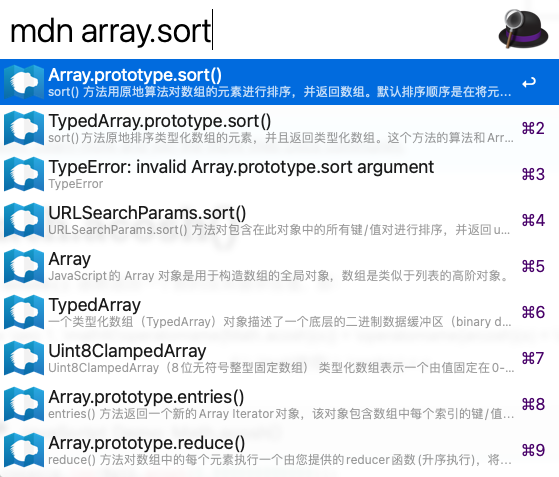

## 说明

1. 使用 MDN 搜索 API 自带的 popularity 字段对结果进行排序，即按热度进行排序。
2. 原始访问 MDN 地址非常慢，为了加快速度，在访问 MDN 的时候可以设置本地代理，具体方法见下面 `代理` 一节
3. 原作者使用 documents[n].highlight.body[0] 作为结果，其优点是内容更详细，缺点是需要 html 过滤，作者只使用了简单的过滤，因此搜索结果会有一些 html 字符和乱码。我改成使用 documents[n].summary 作为搜索结果的详情，优点是没有 html 字符/乱码的干扰，更清晰，缺点是内容较少，只能看第一句，不过即使是长了在 Alfred 中显示的也是省略号，没有意义。
4. 因为 MDN 的搜索 API 的接口总是变化，因此如果发现不可用，请 [电报联系我](https://t.me/xheldon_saloon) 或者在 Github 给我提 [Issue](https://github.com/Xheldon/alfred-mdn-cn/issues)。
5. 搜索结果可能不存在，因为中文存在未翻译的情况，如果没有搜索结果，则点击查看全部的时候，显示的是英文。
6. 结果默认返回 10 条，（包含过滤的条数），不使用代理进行搜索。
7. 我过滤不显示了一部分内容，包括：
    1. summary 以 「«」符号开头的的内容，因为其内容没有意义。

## 建议

直接使用 node fetch 较慢，建议使用代理，代理方法见下


# alfred-mdn-cn
> 搜索 MDN 中文文档




## Install

```
$ npm install -g alfred-mdn-cn
```

*Requires [Node.js](https://nodejs.org) 4+ and the Alfred [Powerpack](https://www.alfredapp.com/powerpack/).*


## 使用

### 常规搜索

在 Alfred 中，输入 `mdn` + 空格 + 搜索内容，如 `mdn filter`。

选择一个 item，回车，即可打开 MDN 官方中文文档查看。

### 使用本地代理加快搜索

如果本地代理地址为 `127.0.0.1:7890`，则在 Alfred 中，输入 `mdn --p=7890` ，然后重新搜索，即可使用代理进行搜索。

注：若代理配置错误，则会出现如下提示：


### 设置每页搜索条数

输入 `mdn --s=20` ，则之后的每次搜索，即可将结果变为 20条（含过滤掉的）

### 设置搜索页数

输入 `mdn <query> 2` ，则可以搜索第二页的内容，如 `mdn sort 2`（注意空格），仅对当次搜索有效。

### 还原设置

如果要恢复默认搜索，则在 Alfred 中，将各个设置参数改成 `dft` 即可还原设置，如 `mdn --p=dft --s=dft`

### 支持同时设置

如 `mdn --p=dft --s=30 2` 则表示不使用代理、搜索结果设置为 30 条，搜索第二页的内容；其中不使用代理和搜索结果设置为 30 条对后续搜索都有效，搜索第二页的内容仅对当前搜索结果生效。

## 注意

如果发现搜索结果出不来，很可能是因为你配置错了，请按照文档重新配置！

## License

MIT © [Klaas Cuvelier](https://klaascuvelier.io)
[Xheldon](https://xheldon.com)
